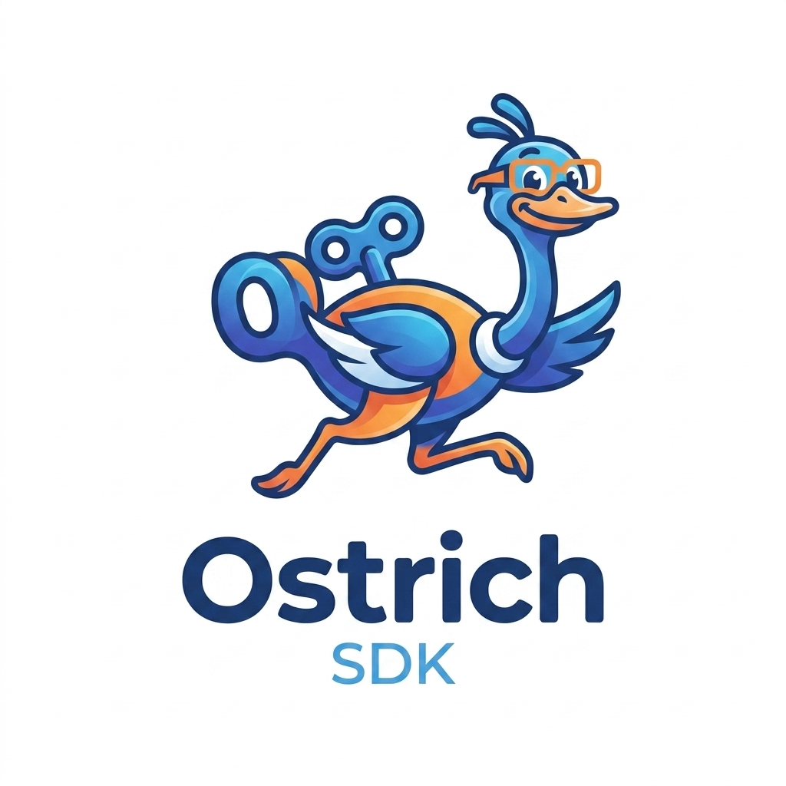

# Deploy like an Ostrich with ostd CLI !

<p align="center">
  
</p>

```text
                              _              
     ____   ___  _____  ___  |_| ___  __   _  
    / __ \ / __||_   _||   ) | |/ __||  |_| | 
    |(oO)| \__ \  | |  |   \ | |\__ \)   _  | 
    \_\/_/ |___/  |_|  |_|\_\|_||___/|__| |_|_  _
      ||                            ___   __| || | __
      ||                           / __| / _` || |/ /
                                   \__ \| (_| ||   < 
                                   |___/ \__,_||_|\_\
```

In this scenario, we will use the ostr CLI to deploy through
a ostrich agent running on a Kubernetes cluster.
